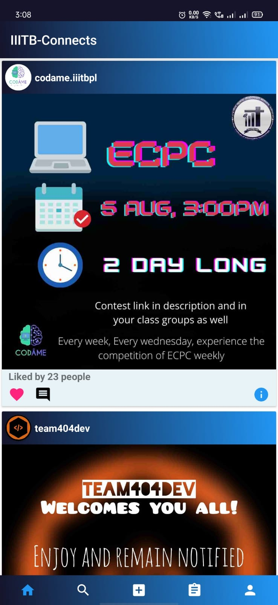
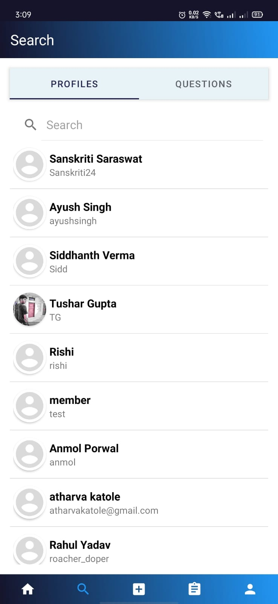
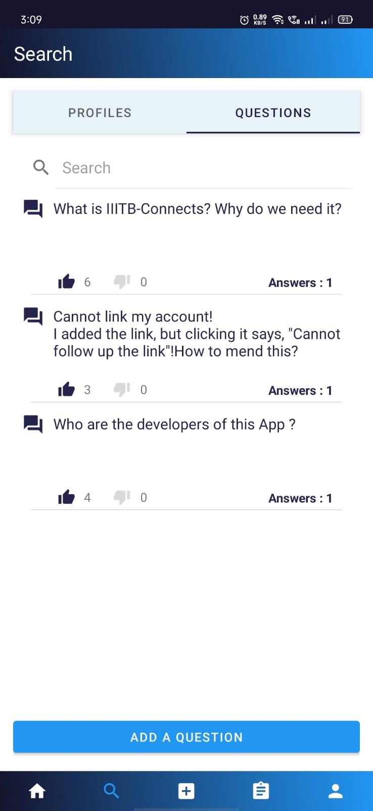
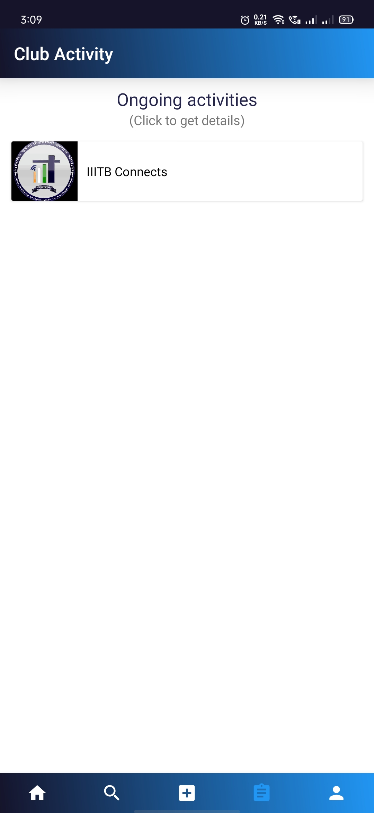

# IIITB Connects

**Connect! Enquire! Contribute!**
 
[IIITB Connects](https://drive.google.com/file/d/10zInx5NRFYp0vy0fF5xYQ9d62nOwiZtL/view?usp=drivesdk) is a project by the students, for the students of IIIT Bhopal. This lets you connect efficiently with your college mates, enquire your queries, helps your colleagues through their problems, and build connections.

## Vision
Why use IIITB Connects when most of the things can be done through other social media platforms? When we have a place solely developed for a “purpose” then it gets most of our attention. Aren’t your college groups muted and get spammed? Do you always see Instagram post of your college club, on the top, or is it some random celebrity and memes? Many a times, we miss out some important notices...won’t happen from now. Asking questions, comes up with some hesitation, ask anonymously.. problem solved.  
With this app we basically try to reach the sole goal of growth, collectively. Enjoy! Stay happy! Stay connected!!

## Features
* **Home Feeds** - An engineering college is never going to be all about studies, it’s the college clubs that make up the college a lively place and different from the schools. This section of the app lets you know, what’s going on in your college, what events are being planned, what all is there for you. Isn’t it the digital notice board!
* **Find friends** - College is our journey of 4 years but can you expect it without friends? Then this place is for you. Search for profile of your friends see what all is going through their heads, what all they are interested in, and are you gonna vibe with them. Connect to their social media platforms(Instagram, LinkedIn) by a click.
* **Ask** - Googling answers is not a tough job now, and most of the time you reach correct solutions as well. But never thought, these must be professional answering. What if you ask directly from college mates, won’t these answers, coming from colleagues, comfort you more. Moreover, questions are added anonymously, but don’t try over exercising this freedom.. Google vs Your buddy.. Who do you choose?
* **Answer** - You’ve got skills, right? How do you show them? Come on, help your buddies through their queries. Hit the answer section with different approaches, different mindset. Why to keep this just to the classroom and bench mate, grow your network, help them everywhere.
* **Club activities** - Who contributes the most to the college... administration? Nope.. its you.. Contribute to your college through club activities, write notice/reports for the events, make posters, write articles for magazine, provide technical assistance, and what not. College clubs count on you! Contribute!

## App Screens

 <strong>Home Feeds</strong>

 <strong>Search Friends</strong>

 <strong>Question/Answer</strong>

 <strong>Ongoing Activities</strong>

 <strong>User Profile</strong>

